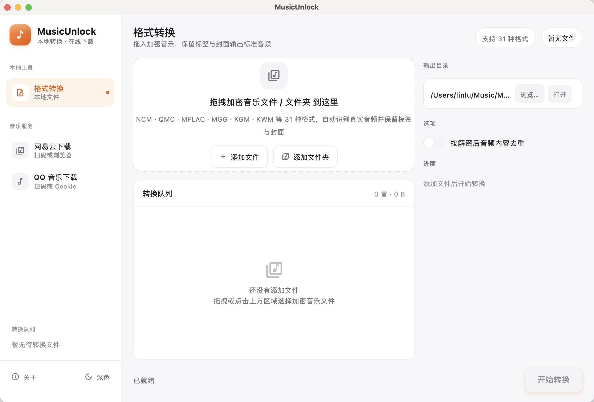
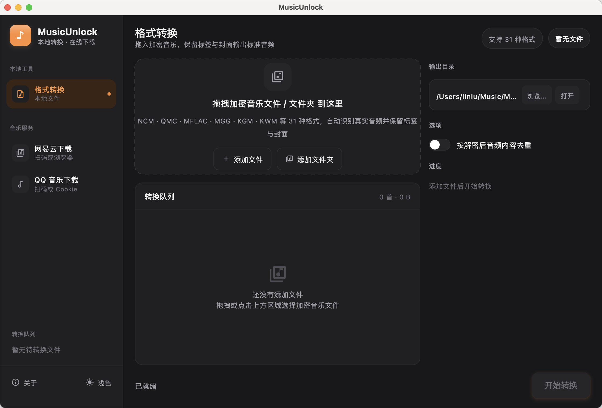
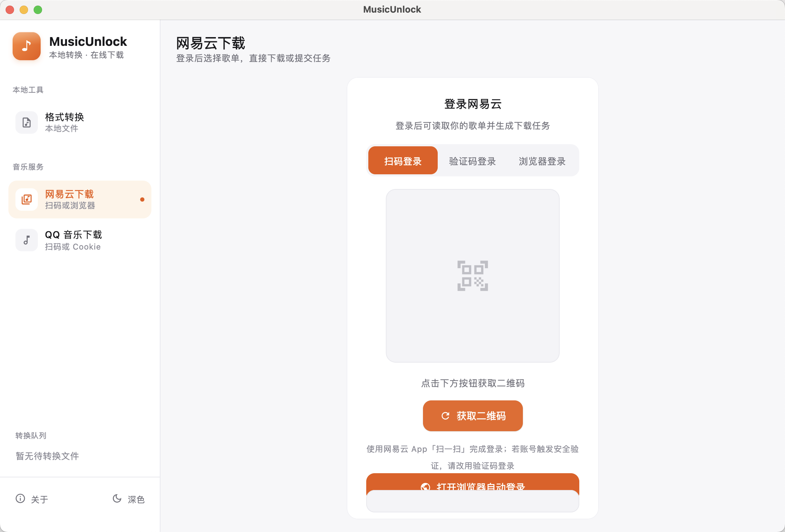
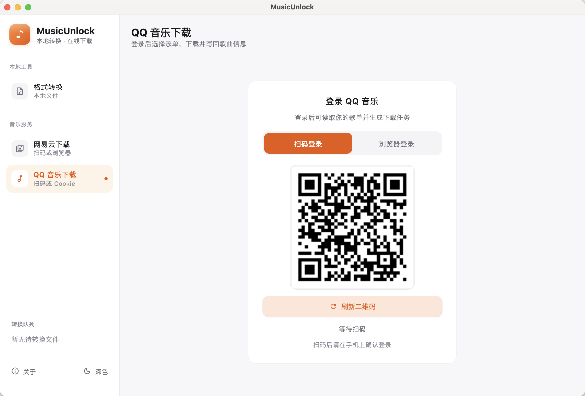

# MusicUnlock 多平台加密音乐格式转换工具

基于 **Kotlin + Compose Multiplatform** 的桌面工具，将网易云/QQ音乐/酷狗/酷我等平台的加密音乐格式转换为标准音频格式（mp3/flac/ogg/m4a 等），带现代桌面 GUI 与命令行批量转换。

> **仅供学习与技术交流，请勿用于商业用途，请在合法范围内使用。**

## 界面预览

纯净白 · 精密工具风格：近白底、白色卡片、发丝线分隔，品牌橙单点强调；格式徽章按平台家族着色，状态一眼可读。

| 浅色 · 转换工作区 | 深色 · 转换工作区 |
|:---:|:---:|
|  |  |

| 网易云下载 · 登录 | QQ 音乐下载 · 登录 |
|:---:|:---:|
|  |  |

## 功能特性

- 覆盖网易云 / QQ音乐 / 酷狗 / 酷我四家主流平台的加密格式
- 自动识别解密后的真实音频格式（MP3/FLAC/OGG/M4A/WAV 等），保留内嵌标签与封面；NCM 额外写回歌名/歌手/专辑/封面
- 深/浅双主题一键切换
- 拖拽或点击添加文件/文件夹，队列内逐文件显示格式、大小与状态
- 按解密后音频内容做 SHA-256 去重（保留不带 `(N)` 后缀的文件）
- 设置自动保存到 `~/.musicunlock/config`：输出目录、去重、输出格式与码率、窗口大小和登录状态都会在重启后继续使用，并可一键恢复默认
- 网易云下载：扫码 / 短信验证码 / 浏览器三种方式登录 → 查看并多选歌单 → 下载 MP3（保留歌名/歌手/专辑/封面）
- QQ 音乐下载：扫码 / 浏览器两种方式登录（浏览器不可用时可直接粘贴 Cookie）→ 查看并多选歌单 → 下载 MP3（保留歌名/歌手/专辑/封面）
- 启动时检查 GitHub Releases 的正式版本，发现更新时在内容区顶部提示，可直接跳转下载页
- 「关于」入口展示当前版本与项目简介，并可一键跳转 GitHub 项目页
- 命令行批量转换与桌面 GUI 两用

## 支持格式

| 平台 | 扩展名 |
|---|---|
| 网易云音乐 | `ncm` |
| QQ音乐 | `qmc0` `qmc2` `qmc3` `qmc4` `qmc6` `qmc8` `qmcflac` `qmcogg` `tkm` `mflac` `mflac0` `mflac1` `mflac2` `mgg` `mgg0` `mgg1` `mgg2` `mggl` `mmp4` `bkcmp3` `bkcm4a` `bkcflac` `bkcwav` `bkcape` `bkcogg` `bkcwma` |
| 酷狗音乐 | `kgm` `kgma` `vpr` |
| 酷我音乐 | `kwm` |

## 快速开始

需要 JDK 17+：

```bash
./gradlew run              # 启动桌面 GUI
./gradlew run --args="-h"  # 命令行帮助
./gradlew test             # 运行测试（含 unlock-music 真实样本向量）
```

## 图形界面使用说明

### 1. 添加文件

- 直接把加密音乐文件或文件夹**拖进**虚线区域，或点击「添加文件 / 添加文件夹」选择。
- 队列会列出每个文件：左侧为格式徽章（NCM 橙 / QMC 靛蓝 / KGM 青绿 / KWM 紫），中间为文件名与大小，右侧为状态。

### 2. 设置输出与转码

- 右侧「输出目录」显示默认位置 `~/Music/MusicUnlock`（用户主目录下，打包版会自动创建）。
- 点「浏览…」更换目录，点「打开」在系统文件管理器中查看。
- 「输出格式」可沿用解密后的原始格式，也可选择 MP3；选择 MP3 后可设置 128k / 192k / 320k 码率，转码使用系统 ffmpeg。

### 3. 选择是否去重

- 打开「按解密后音频内容去重」开关后，转换时会对**解密后的音频**做 SHA-256：内容相同的歌曲只保留一个，优先保留不带 `(N)` 后缀的文件（例如同时存在 `晴天.ncm` 与 `晴天 (1).ncm` 时保留前者），其余标记为「重复」。

### 4. 开始转换

- 点右下角「开始转换」，逐文件进行：状态会从「等待中 → 转换中（行内进度条）→ 已完成 / 失败」。
- 转换过程中队列锁定（不能移除文件或修改输出目录/去重开关），完成后即可在输出目录找到结果。

### 5. 状态说明

| 状态 | 含义 |
|---|---|
| 等待中 | 排队中，尚未开始 |
| 转换中 | 正在处理，行内有橙色渐变进度条 |
| 已完成 | 转换成功，已写入输出目录 |
| 失败 | 文件损坏或不支持，行内会显示具体原因 |
| 重复 | 与队列中其他文件解密后内容相同，被去重跳过 |

### 6. 新版本提示

- 每次启动检查一次 GitHub Releases 的最新正式版本，只有存在更高版本时才会在内容区顶部出现橙色提示条。
- 点「前往下载」在系统浏览器打开对应 Release 页面，点「忽略」收起提示。
- 检查超时、离线或接口异常时静默跳过，不影响启动与转换。
- 当前版本与项目链接可从左侧导航底部的「关于」入口查看，卡片内可直接跳转 GitHub 项目页。

## 网易云下载

从左侧「音乐服务」切到「网易云下载」，可把网易云歌单歌曲下载为 MP3。

### 1. 登录

登录页提供三种方式，登录态会保存到本机配置文件；成功后界面展示账号昵称与头像，点「退出登录」即清除保存的会话。

- **扫码登录**：点击「获取二维码」，用网易云 App「扫一扫」完成登录。部分账号会触发网易云服务端的安全验证（返回 8821），此时扫码无法完成，请改用浏览器登录。
- **验证码登录**：输入网易云绑定手机号，点击「发送验证码」后填入验证码登录。若当前网络触发安全验证，会提示改用浏览器登录。
- **浏览器登录（推荐）**：自动打开本机 Chrome/Edge 进入网易云官方登录页，你在浏览器内完成登录后自动读取登录态并回到 App，无需复制粘贴。

### 2. 选择歌单

- 登录后自动列出全部歌单（含收藏），显示封面、名称与歌曲数。
- 支持勾选多个歌单，提供「全选 / 清空 / 刷新」。

### 3. 下载 MP3

- 点「下载 MP3」把选中歌单的歌曲下载到右侧输出目录（默认 `~/Music/MusicUnlock`）。
- 按官方接口获取音频，高码率优先、不可用时自动降级；输出统一为 MP3，并写回歌名 / 歌手 / 专辑 / 封面。
- 官方返回 FLAC 等非 MP3 格式时，自动调用系统 ffmpeg 转码为 MP3（未安装 ffmpeg 时保留原格式并提示）。
- **会员歌曲**：登录的账号有会员权限即可下载（请求携带登录态，自动取会员高码率）；非会员账号官方只返回试听片段，会明确提示「仅可获取试听片段」并跳过，不会静默下载试听版。
- **灰色歌曲（无版权 / 已下架）**：网易云在你所在地区没有该歌曲版权，官方接口不返回任何播放地址，即使登录会员也无法下载，会提示「灰色歌曲：无版权或已下架」。

## QQ 音乐下载

从左侧「音乐服务」切到「QQ 音乐下载」，登录 QQ 音乐账号后即可把歌单歌曲下载为 MP3。

### 1. 登录

登录页提供两种方式，登录态与票据会保存到本机配置文件；成功后界面展示账号昵称与头像，点「退出登录」即清除保存的会话。

- **扫码登录**：点击「刷新二维码」后用手机 QQ「扫一扫」完成登录，并在手机上确认。登录会按 QQ 音乐网页版流程换取播放票据，账号内可播放的歌曲即可下载。
- **浏览器登录（推荐）**：自动打开本机 Chrome/Edge 进入 QQ 音乐官方登录页，在浏览器内完成登录后自动读取登录态并回到 App，无需复制粘贴。浏览器不可用时，可在同一页面手动粘贴完整 Cookie（需包含 `uin` 与播放票据 `qm_keyst` / `qqmusic_key`）登录。

### 2. 选择歌单

- 登录后自动列出账号下的歌单（含「我喜欢的音乐」，若官方接口返回），显示封面、名称与歌曲数。
- 支持勾选多个歌单，提供「全选 / 清空 / 刷新」。

### 3. 下载 MP3

- 点「下载 MP3」把选中歌单的歌曲下载到右侧输出目录（默认 `~/Music/MusicUnlock`）。
- 按官方接口获取音频，320k 优先、不可用时自动降级到 128k；输出统一为 MP3，并写回歌名 / 歌手 / 专辑 / 封面。
- 官方返回 FLAC / M4A 等非 MP3 格式时，自动调用系统 ffmpeg 转码为 MP3（未安装 ffmpeg 时保留原格式并提示）。
- **VIP 专属歌曲**：需要账号具备对应会员权限；无权限时官方不返回播放地址，会明确提示「VIP 专享歌曲」并跳过。
- **数字专辑 / 需单独购买**：部分歌曲需在 QQ 音乐内购买后才能下载，会明确提示并跳过。
- **无版权 / 已下架歌曲**：官方接口不返回播放地址，会明确提示并跳过，不会静默下载试听片段。

## 命令行

```
./gradlew run --args="-c ~/Music/网易云 -o ~/Music/转换结果 -d"
```

| 参数 | 说明 |
|---|---|
| `-c, --convert [path] ...` | 转换路径下的所有加密音乐文件（支持文件或文件夹，可多个） |
| `-o, --output [dir]` | 自定义输出目录（默认 `./output`） |
| `-d, --dedup` | 按解密后音频内容去重，优先保留不带 `(N)` 后缀的文件 |
| `-v, --view` | 打开图形界面（不带参数时默认打开） |
| `-h, --help` | 帮助 |

### 常用示例

```bash
# 转换单个文件
./gradlew run --args="-c ~/Music/晴天.ncm -o ~/Music/转换结果"

# 批量转换多个文件夹并去重
./gradlew run --args="-c ~/Music/网易云 ~/Music/QQ音乐 -o ~/Music/转换结果 -d"

# 查看帮助
./gradlew run --args="-h"
```

> 注意：去重是对**解密后音频**做 SHA-256，而不是对加密文件做哈希——同名歌曲即使加密文件不同（元数据/歌曲 ID 不同），解密后音频相同也能正确去重。

### 常见问题

- **转换后文件在哪？** GUI 默认输出到 `~/Music/MusicUnlock`，可在右侧「输出目录」查看或更改；命令行默认 `./output`，用 `-o` 指定。
- **转换失败怎么办？** 队列行内会显示具体原因（如文件已损坏、格式不支持）。解密算法基于公开格式规范，仅适用于合法获取的文件。
- **为什么会显示「重复」？** 开启了去重且该文件解密后的音频与队列中其他文件相同，属正常跳过。
- **打包版双击后如何打开？** macOS 打开 `.dmg` 后把 MusicUnlock 拖入「应用程序」即可启动；Windows 直接双击单文件 `MusicUnlock.exe`（内嵌 JRE，首次启动自动解压到临时目录运行，退出后自动清理），无参数默认进入图形界面。

## 原生打包（需在对应操作系统上执行）

```bash
./gradlew packageDmg              # macOS .dmg
./gradlew createDistributable     # Windows exe + 自带 JRE 的应用目录
```

- macOS 发布物为 `.dmg`。
- Windows 发布物为单文件 `MusicUnlock-<版本>-windows.exe`：由 7-Zip SFX 封装，内嵌 JRE，无外部资源文件，双击自动解压到临时目录运行、退出后自动清理。
- 跨平台一键打包见 [.github/workflows/build.yml](.github/workflows/build.yml)（GitHub Actions 矩阵：macOS + Windows）。

## 项目结构

```
src/main/kotlin/musicunlock/
  core/           多格式解密核心（纯 Kotlin）
    NcmDecoder.kt / NcmCipher.kt / NcmMetadata.kt   网易云 NCM
    QmcDecoder.kt / QmcKey.kt / QmcCipher.kt / TeaCipher.kt   QQ音乐 QMC
    KgmDecoder.kt  酷狗 KGM/KGMA/VPR
    KwmDecoder.kt  酷我 KWM
    AudioSniffer.kt / Formats.kt / MusicDecoder.kt
  ncm/            网易云下载
    NeteaseApi.kt     扫码/短信验证码登录（weapi 加密）/ 账号 / 歌单 / 播放地址
    BrowserLogin.kt   浏览器登录（CDP 读取登录态 Cookie）
    Mp3Downloader.kt  官方下载、MP3 转码、标签写回
  service/        MusicConverter（转换编排）、TagWriter（标签写回）
  cli/            MainCli（命令行）
  ui/             App.kt（左侧导航与转换工作区）、DownloadPage.kt（网易云下载页）、Theme.kt、FileDialogs.kt
```

## 算法来源与致谢

- NCM 解密：基于公开的 .ncm 容器格式规范实现，算法与 [unlock-music](https://github.com/kevinstoy/unlock-music)（MIT）一致
- QMC 系列（密钥派生、TEA、Static/Map/RC4 流密码）：[unlock-music](https://github.com/kevinstoy/unlock-music)（MIT）
- KGM/VPR： [MyKgmWasm](https://github.com/huangbao/MyKgmWasm)（MIT）与 [unlock-music](https://github.com/kevinstoy/unlock-music)（MIT）
- KWM：[unlock-music](https://github.com/kevinstoy/unlock-music)（MIT）

测试向量来自 unlock-music 项目的 `testdata/`（MIT）。

## 许可证（License）

本项目采用 [MIT License](LICENSE)。
第三方算法与依赖声明见 [THIRD_PARTY_NOTICES.md](THIRD_PARTY_NOTICES.md)。

## 免责声明

本项目仅用于学习密码学与文件格式分析，请勿用于任何商业用途或侵犯他人权益。
