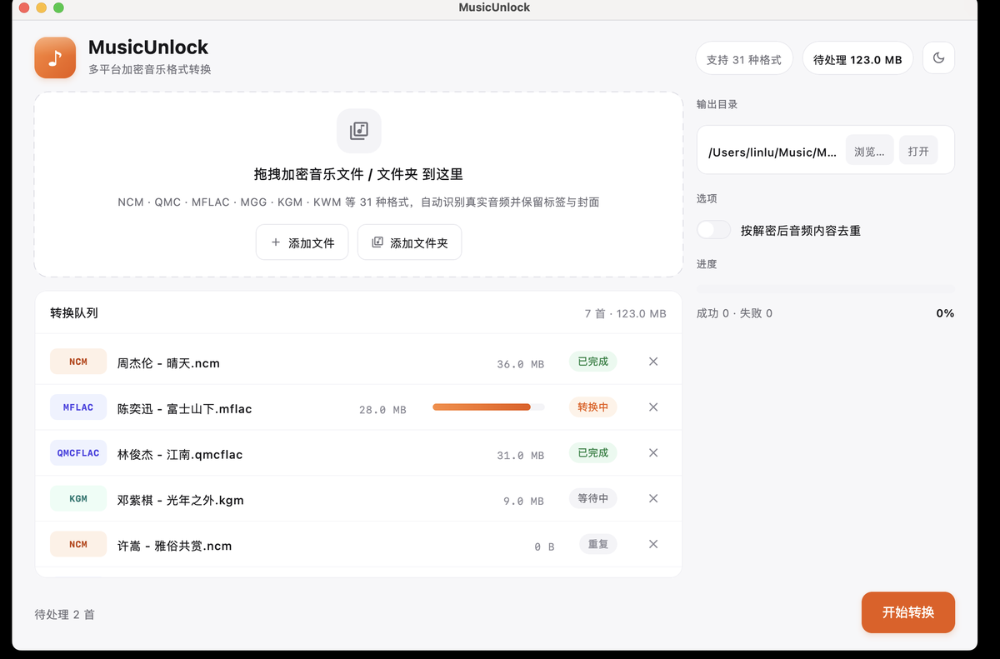
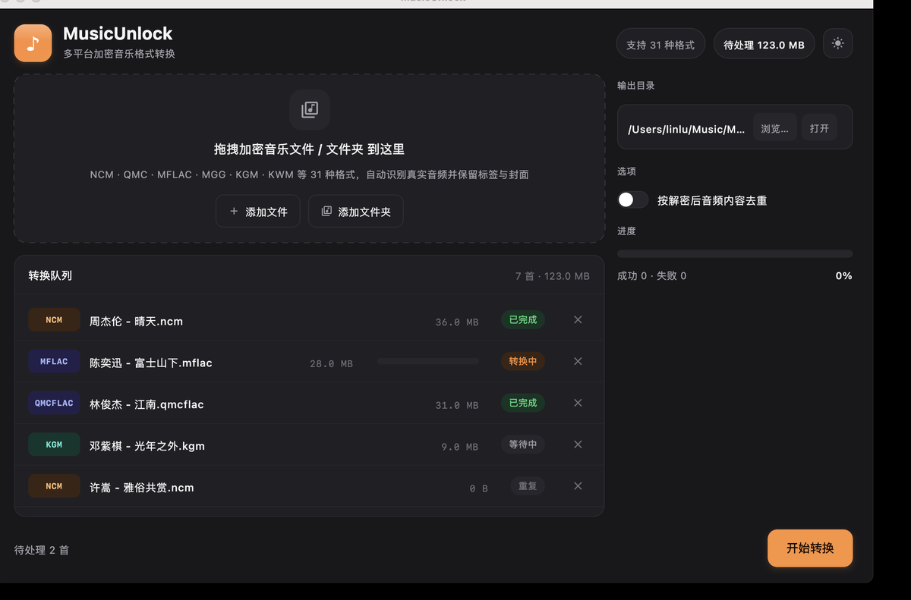

# MusicUnlock 多平台加密音乐格式转换工具

基于 **Kotlin + Compose Multiplatform** 的桌面工具，将网易云/QQ音乐/酷狗/酷我等平台的加密音乐格式转换为标准音频格式（mp3/flac/ogg/m4a 等），带现代桌面 GUI 与命令行批量转换。

> **仅供学习与技术交流，请勿用于商业用途，请在合法范围内使用。**

## 界面预览

纯净白 · 精密工具风格：近白底、白色卡片、发丝线分隔，品牌橙单点强调；格式徽章按平台家族着色，状态一眼可读。

| 浅色 · 转换队列 | 深色 · 转换队列 |
|:---:|:---:|
|  |  |


## 功能特性

- 覆盖网易云 / QQ音乐 / 酷狗 / 酷我四家主流平台的加密格式
- 自动识别解密后的真实音频格式（MP3/FLAC/OGG/M4A/WAV 等），保留内嵌标签与封面；NCM 额外写回歌名/歌手/专辑/封面
- 深/浅双主题一键切换
- 拖拽或点击添加文件/文件夹，队列内逐文件显示格式、大小与状态
- 按解密后音频内容做 SHA-256 去重（保留不带 `(N)` 后缀的文件）
- 命令行批量转换与桌面 GUI 两用

## 支持格式

| 平台 | 扩展名 |
|---|---|
| 网易云音乐 | `ncm` |
| QQ音乐 | `qmc0` `qmc2` `qmc3` `qmc4` `qmc6` `qmc8` `qmcflac` `qmcogg` `tkm` `mflac` `mflac0` `mflac1` `mflac2` `mgg` `mgg0` `mgg1` `mgg2` `mggl` `mmp4` `bkcmp3` `bkcm4a` `bkcflac` `bkcwav` `bkcape` `bkcogg` `bkcwma` |
| 酷狗音乐 | `kgm` `kgma` `vpr` |
| 酷我音乐 | `kwm` |

## 快速开始

需要 JDK 17+：

```bash
./gradlew run              # 启动桌面 GUI
./gradlew run --args="-h"  # 命令行帮助
./gradlew test             # 运行测试（23 个，含 unlock-music 真实样本向量）
```

## 图形界面使用说明

### 1. 添加文件

- 直接把加密音乐文件或文件夹**拖进**虚线区域，或点击「添加文件 / 添加文件夹」选择。
- 队列会列出每个文件：左侧为格式徽章（NCM 橙 / QMC 靛蓝 / KGM 青绿 / KWM 紫），中间为文件名与大小，右侧为状态。

### 2. 设置输出目录

- 右侧「输出目录」显示默认位置 `~/Music/MusicUnlock`（用户主目录下，打包版会自动创建）。
- 点「浏览…」更换目录，点「打开」在系统文件管理器中查看。

### 3. 选择是否去重

- 打开「按解密后音频内容去重」开关后，转换时会对**解密后的音频**做 SHA-256：内容相同的歌曲只保留一个，优先保留不带 `(N)` 后缀的文件（例如同时存在 `晴天.ncm` 与 `晴天 (1).ncm` 时保留前者），其余标记为「重复」。

### 4. 开始转换

- 点右下角「开始转换」，逐文件进行：状态会从「等待中 → 转换中（行内进度条）→ 已完成 / 失败」。
- 转换过程中队列锁定（不能移除文件或修改输出目录/去重开关），完成后即可在输出目录找到结果。

### 5. 状态说明

| 状态 | 含义 |
|---|---|
| 等待中 | 排队中，尚未开始 |
| 转换中 | 正在处理，行内有橙色渐变进度条 |
| 已完成 | 转换成功，已写入输出目录 |
| 失败 | 文件损坏或不支持，行内会显示具体原因 |
| 重复 | 与队列中其他文件解密后内容相同，被去重跳过 |

## 命令行

```
./gradlew run --args="-c ~/Music/网易云 -o ~/Music/转换结果 -d"
```

| 参数 | 说明 |
|---|---|
| `-c, --convert [path] ...` | 转换路径下的所有加密音乐文件（支持文件或文件夹，可多个） |
| `-o, --output [dir]` | 自定义输出目录（默认 `./output`） |
| `-d, --dedup` | 按解密后音频内容去重，优先保留不带 `(N)` 后缀的文件 |
| `-v, --view` | 打开图形界面（不带参数时默认打开） |
| `-h, --help` | 帮助 |

### 常用示例

```bash
# 转换单个文件
./gradlew run --args="-c ~/Music/晴天.ncm -o ~/Music/转换结果"

# 批量转换多个文件夹并去重
./gradlew run --args="-c ~/Music/网易云 ~/Music/QQ音乐 -o ~/Music/转换结果 -d"

# 查看帮助
./gradlew run --args="-h"
```

> 注意：去重是对**解密后音频**做 SHA-256，而不是对加密文件做哈希——同名歌曲即使加密文件不同（元数据/歌曲 ID 不同），解密后音频相同也能正确去重。

### 常见问题

- **转换后文件在哪？** GUI 默认输出到 `~/Music/MusicUnlock`，可在右侧「输出目录」查看或更改；命令行默认 `./output`，用 `-o` 指定。
- **转换失败怎么办？** 队列行内会显示具体原因（如文件已损坏、格式不支持）。解密算法基于公开格式规范，仅适用于合法获取的文件。
- **为什么会显示「重复」？** 开启了去重且该文件解密后的音频与队列中其他文件相同，属正常跳过。
- **打包版双击后如何打开？** macOS `.dmg/.pkg`、Windows `.msi/.exe`、Linux `.deb/.rpm` 安装后直接启动应用，无参数默认进入图形界面。

## 原生打包（需在对应操作系统上执行）

```bash
./gradlew packageDmg       # macOS .dmg / .pkg
./gradlew packageMsi       # Windows .msi / .exe
./gradlew packageDeb       # Linux .deb / .rpm
```

三平台一键打包见 [.github/workflows/build.yml](.github/workflows/build.yml)（GitHub Actions 矩阵）。

## 项目结构

```
src/main/kotlin/musicunlock/
  core/           多格式解密核心（纯 Kotlin）
    NcmDecoder.kt / NcmCipher.kt / NcmMetadata.kt   网易云 NCM
    QmcDecoder.kt / QmcKey.kt / QmcCipher.kt / TeaCipher.kt   QQ音乐 QMC
    KgmDecoder.kt  酷狗 KGM/KGMA/VPR
    KwmDecoder.kt  酷我 KWM
    AudioSniffer.kt / Formats.kt / MusicDecoder.kt
  service/        MusicConverter（转换编排）、TagWriter（标签写回）
  cli/            MainCli（命令行）
  ui/             App.kt（Compose 界面）、Theme.kt（主题）、FileDialogs.kt
```

## 算法来源与致谢

- NCM 解密：基于公开的 .ncm 容器格式规范实现，算法与 [unlock-music](https://github.com/kevinstoy/unlock-music)（MIT）一致
- QMC 系列（密钥派生、TEA、Static/Map/RC4 流密码）：[unlock-music](https://github.com/kevinstoy/unlock-music)（MIT）
- KGM/VPR： [MyKgmWasm](https://github.com/huangbao/MyKgmWasm)（MIT）与 [unlock-music](https://github.com/kevinstoy/unlock-music)（MIT）
- KWM：[unlock-music](https://github.com/kevinstoy/unlock-music)（MIT）

测试向量来自 unlock-music 项目的 `testdata/`（MIT）。

## 许可证（License）

本项目采用 [MIT License](LICENSE)。
第三方算法与依赖声明见 [THIRD_PARTY_NOTICES.md](THIRD_PARTY_NOTICES.md)。

## 免责声明

本项目仅用于学习密码学与文件格式分析，请勿用于任何商业用途或侵犯他人权益。
